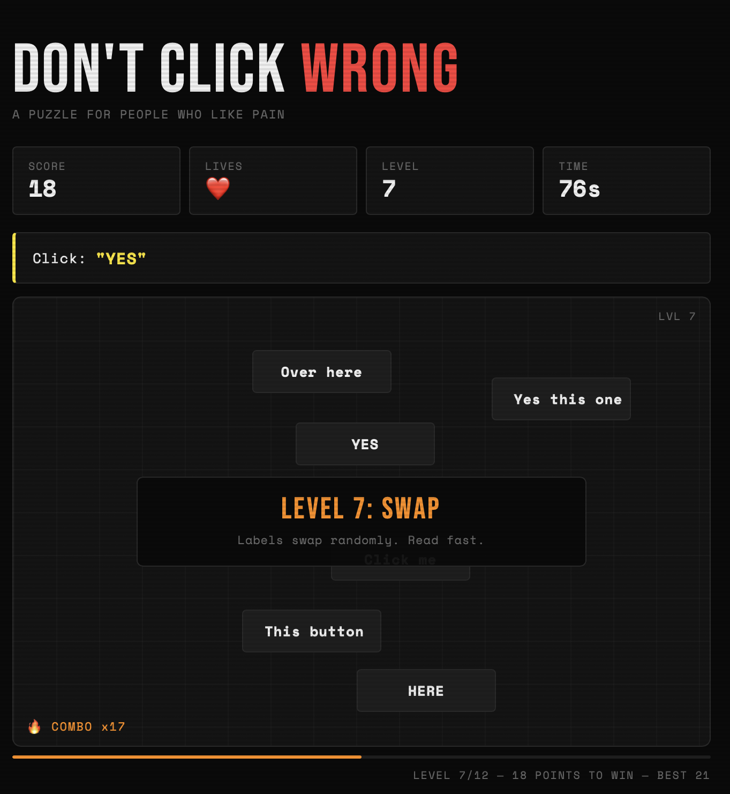

# DON'T CLICK WRONG



A chaotic dark-arcade browser game where the only rule is simple:

**Click the correct button. Do not click wrong.**

The game starts easy, then quickly turns into moving buttons, fake labels, blinking targets, shrinking buttons, combo rewards, screen shake, particles, panic mode, and a final boss that absolutely does not want you to win.

## Game Link

Project / GitHub link:

https://github.com/Rishabjainwork/rishabjainwork.github.io

If this repository is deployed with GitHub Pages, the game can be played from:

https://Rishabjainwork.github.io

## Preview

**DON'T CLICK WRONG** is built to feel chaotic, funny, and streamer-friendly:

- dark arcade interface
- neon cyberpunk feedback
- ragebait taunts
- fast levels
- satisfying sound and visual effects
- lightweight vanilla web implementation

## How To Play

1. Read the instruction at the top of the screen.
2. Find the button with the exact matching label.
3. Click it.
4. Avoid every wrong button.
5. Reach 36 points to beat all 12 levels.

You start with 3 lives. At level 12, the final boss gives you 1 life. Good luck.

## Features

- 12 escalating levels
- Moving buttons
- Correct target movement
- Blinking buttons
- Shrinking buttons
- Fake labels
- Instruction flicker
- Combo system
- Combo rewards
- Final boss panic mode
- Random chaos events
- Screen shake
- Particle explosions
- Button pop, bounce, glow, and flash effects
- Dynamic background music tension
- Sound effects with preloaded audio pools
- Taunts on wrong clicks
- Best score saved with `localStorage`
- Mobile vibration feedback
- Responsive desktop and mobile layout

## Combo Rewards

| Combo | Reward |
| --- | --- |
| x5 | Bonus visual burst |
| x8 | Temporary slow motion |
| x10 | Brief button freeze |

## Controls

| Action | Control |
| --- | --- |
| Click button | Mouse click / tap |
| Start or restart | `Enter` or `Space` |

## Tech Stack

- **HTML5** for structure
- **CSS3** for layout, animations, arcade styling, particles, shake, and responsive design
- **Vanilla JavaScript** for game logic, timers, levels, audio, effects, and local storage

No frameworks. No build tools. No dependencies.

## Run Locally

Clone the repository:

```bash
git clone https://github.com/Rishabjainwork/rishabjainwork.github.io.git
```

Open the project folder:

```bash
cd rishabjainwork.github.io
```

Then open `index.html` in your browser.

You can also use a local server if you prefer:

```bash
python3 -m http.server 8000
```

Then visit:

```text
http://localhost:8000
```

## Project Structure

```text
.
├── index.html
├── script.js
├── style.css
├── readme.md
└── sound/
    ├── correct.mp3
    ├── combo.mp3
    ├── levelup.mp3
    ├── gameover.mp3
    ├── wrong.mp3
    └── music.mp3
```

## Customization

Game tuning is mostly in `script.js`:

- `GOAL` controls the score needed to win.
- `MAX_LEVEL` controls the number of levels.
- `BUTTON_W` and `BUTTON_H` control button size.
- `taunts` controls wrong-click messages.
- `deathTaunts` controls game-over messages.
- `labels` controls button text.
- `LEVEL_DEFS` controls level names, descriptions, and banner colors.

Visual styling is in `style.css`:

- colors
- layout
- responsive rules
- particles
- button feedback
- screen shake
- final boss effects

Audio files are in `sound/`. Replace the `.mp3` files with the same filenames to reskin the game sounds.

## Browser Notes

The game uses:

- `Audio`
- `localStorage`
- `navigator.vibrate()`
- CSS animations

Some browsers block audio until the first user interaction. Pressing the start button unlocks game audio.

## Development Check

To quickly check JavaScript syntax:

```bash
node --check script.js
```

## License

Use, remix, and modify freely unless you add your own license terms.

## Author

Made by [Rishab Jain](https://github.com/Rishabjainwork).
